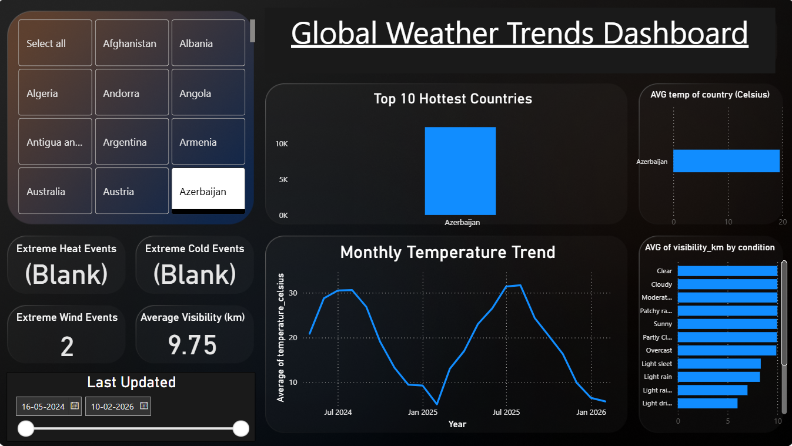

# 🌍 ClimateScope – Global Weather Trends & Extreme Event Analysis


## 🚀 Overview

ClimateScope is a data analytics and visualization project developed during my Infosys Springboard Internship.
It focuses on analyzing global weather data to uncover trends, detect extreme events, and deliver actionable insights through an interactive Power BI dashboard.


---

## 📊 Dashboard Preview




---

## 🎯 Key Objectives

* Analyze large-scale global weather dataset (120K+ records)
* Identify seasonal patterns and regional climate variations
* Detect extreme weather conditions (heat, cold, wind)
* Build an interactive dashboard for real-time insights

---

## 🧠 What I Did (My Contributions)

* Cleaned and preprocessed raw weather data using Python (Pandas)
* Handled missing values, inconsistent formats, and data normalization
* Performed statistical analysis to identify trends and correlations
* Built automated data pipelines (explore → clean → aggregate → analyze)
* Designed and developed an interactive Power BI dashboard
* Implemented filters (country, date) and drill-down analysis
* Extracted key insights for decision-making and reporting

---

## 🛠️ Tech Stack

* **Languages:** Python
* **Libraries:** Pandas, Matplotlib, Seaborn
* **Tools:** Power BI, VS Code
* **Data Format:** CSV

---

## 📂 Project Structure

```
ClimateScope_project/
│── data/
│   ├── raw/
│   │   └── GlobalWeatherRepository.csv
│   ├── processed/
│   │   ├── cleaned_weather.csv
│   │   └── monthly_weather.csv
│
│── scripts/
│   ├── explore.py
│   ├── inspect_data.py
│   ├── clean_data.py
│   ├── aggregate_data.py
│   ├── analysis.py
│
│── image/
│   └── dashboard.png
│
│── Dashboard.pbix
│── preprocesseddata.ipynb
│── README.md
```


---

## 📈 Key Features

* 📊 Monthly temperature trend analysis
* 🌍 Top 10 hottest countries identification
* 🔥 Extreme heat, ❄️ cold, and 🌪️ wind event detection
* 🎯 Interactive filters (country, date range)
* 🔍 Drill-down analysis by location and weather condition
* 📉 Correlation heatmap for weather variables

---

## 🔍 Insights Generated

* Strong seasonal temperature patterns across regions
* High-temperature zones concentrated in Middle East & Africa
* Extreme weather events identified using threshold-based logic
* Weather conditions significantly affect visibility and wind speed

---

## ⚙️ How to Run (Python Scripts)

```bash
pip install pandas matplotlib seaborn

python scripts/explore.py
python scripts/clean_data.py
python scripts/aggregate_data.py
python scripts/analysis.py
```

---

## 📊 Power BI Dashboard

Open `Dashboard.pbix` using Power BI Desktop to explore the interactive dashboard.

---

## 💼 Internship Experience

**Infosys Springboard Internship**

* Worked on real-world weather dataset
* Applied data analysis, visualization, and dashboard design
* Delivered an end-to-end data analytics solution

---

## 👨‍💻 Author

**Ayan Dhal**
